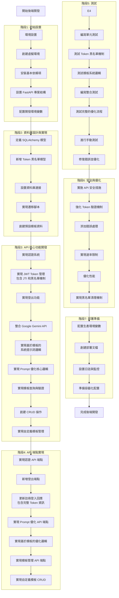

```mermaid
flowchart TD
    A[開始後端開發] --> B[環境設置]
    
    subgraph "階段1: 初始設置"
        B --> B1[創建虛擬環境]
        B1 --> B2[安裝基本依賴項]
        B2 --> B3[設置 FastAPI 專案結構]
        B3 --> B4[配置開發環境變數]
    end
    
    subgraph "階段2: 資料庫設計與實現"
        B4 --> C1[定義 SQLAlchemy 模型]
        C1 --> C1_1[新增 Token 黑名單模型]
        C1_1 --> C2[設置資料庫連接]
        C2 --> C3[實現遷移腳本]
        C3 --> C4[創建預設模板資料]
    end
    
    subgraph "階段3: API 核心功能開發"
        C4 --> D1[實現認證系統]
        D1 --> D1_1[實現 JWT Token 管理<br/>包含 JTI 和黑名單機制]
        D1_1 --> D1_2[實現登出功能]
        D1_2 --> D2[整合 Google Gemini API]
        D2 --> D2_1[實現基於模板的<br/>系統提示詞邏輯]
        D2_1 --> D3[實現 Prompt 優化核心邏輯]
        D3 --> D3_1[實現模板查詢與驗證]
        D3_1 --> D4[創建 CRUD 操作]
        D4 --> D4_1[實現自定義模板管理]
    end
    
    subgraph "階段4: API 端點實現"
        D4_1 --> E1[實現認證 API 端點]
        E1 --> E1_1[新增登出端點]
        E1_1 --> E1_2[更新註冊登入回應<br/>包含完整 Token 資訊]
        E1_2 --> E2[實現 Prompt 優化 API 端點]
        E2 --> E2_1[實現基於模板的優化邏輯]
        E2_1 --> E3[實現模板管理 API 端點]
        E3 --> E3_1[實現自定義模板 CRUD]
    end
    
    subgraph "階段5: 測試"
        E4 --> F1[編寫單元測試]
        F1 --> F1_1[測試 Token 黑名單機制]
        F1_1 --> F1_2[測試模板系統邏輯]
        F1_2 --> F2[編寫整合測試]
        F2 --> F2_1[測試完整的優化流程]
        F2_1 --> F3[進行手動測試]
        F3 --> F4[修復錯誤並優化]
    end
    
    subgraph "階段6: 安全與優化"
        F4 --> G1[實施 API 安全措施]
        G1 --> G1_1[強化 Token 驗證機制]
        G1_1 --> G2[添加錯誤處理]
        G2 --> G3[實現速率限制]
        G3 --> G4[優化性能]
        G4 --> G4_1[實現黑名單清理機制]
    end
    
    subgraph "階段7: 部署準備"
        G4_1 --> H1[配置生產環境變數]
        H1 --> H2[創建部署文檔]
        H2 --> H3[設置日誌與監控]
        H3 --> H4[準備容器化配置]
    end
    
    H4 --> I[完成後端開發]
```
